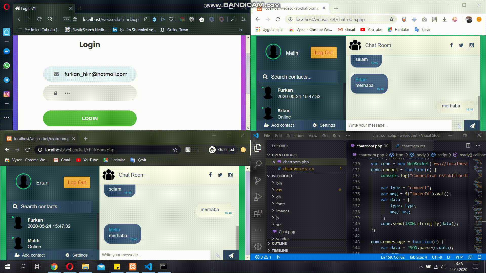

<h1 align="center">Chatroom Web Application</h1>

<div align="center">
  
  
  
  
  
</div>

#### This project was developed using the [Ratchet library](http://socketo.me).


| GIF   	|
|---	|
  

## Usage
Clone this repository to your Local Web Server(Xampp,Wamp Server etc.) directory by using this command. Be sure you have git installed.
```sh
$ git clone https://github.com/furkanhakan/Chatroom-Ratchet.git
```
Start the local web server and go to the project directory and run the following command.
```sh
$ php bin/server.php
```
Then you can use the project by entering ```localhost:8080``` in your web browser.

## Author
👤 **Furkan Hakan**

* Medium: [@furkanhakan](https://medium.com/@furkanhakan)
* Twitter: [@_FurkanHakan](https://twitter.com/_FurkanHakan)
